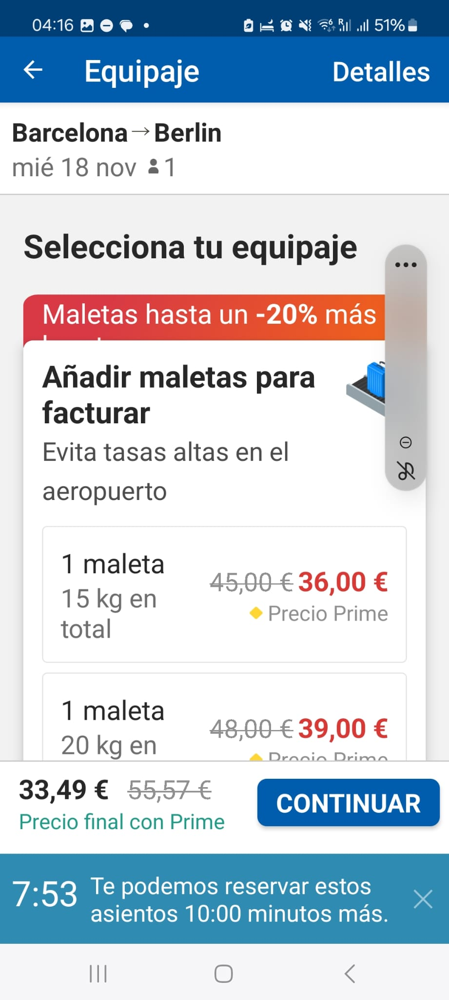
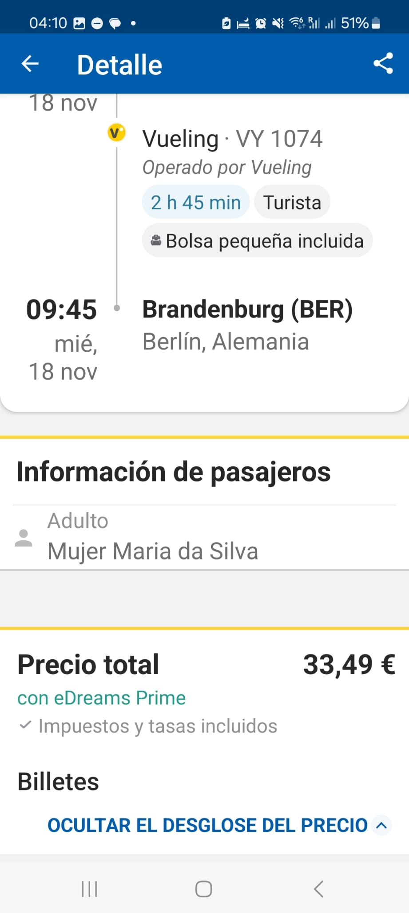

# eDreams Product Case Study: E-Commerce Funnel & UX Analysis
**Executive Summary**

This case study evaluates the end-to-end user experience (UX) and product design of the eDreams mobile and desktop e-commerce booking funnel. The analysis was conducted through a real-time purchasing simulation, navigating from the initial flight search up to the final checkout screen.

To demonstrate a structured, iterative product methodology, this repository is organized into a multi-stage roadmap:

**Stage 1 (Current Scope):** User Experience (UX) & Accessibility Audit.

**Stage 2 (Future Roadmap)**:** Data-Driven Metric Mapping & Cart Abandonment Deep Dive.

**Stage 3 (Future Roadmap):** Dynamic Pricing & Ancillary Revenue Optimization.

## Stage 1: UX & Accessibility Audit (Current Project)
### 1. Friction Points & Areas for Improvement
#### A. Geolocation-Locked Language & Currency Inflexibility

🔴 **High Friction**

The Issue: The platform rigidly forces the interface language based on the user's detected IP address or chosen country (e.g., forcing Spanish if the user is in Spain). Additionally, the system aggressively requests location permissions and displays mismatching default currencies (e.g., Pounds instead of Euros) with no intuitive way to manually override language or currency settings.

UX Impact: This creates a severe barrier for expatriates and digital nomads who reside in a country but do not speak the local language. It also alienates privacy-conscious users who prefer not to share their exact location.

#### B. Dynamic Font Layout Break (Accessibility Bug)

🟠 **UI / Accessibility Bug**

The Issue: On the baggage selection screen, an important promotional banner highlighted in orange ("Maletas hasta un -20% más...") suffered severe text truncation. The crucial parts of the text were completely hidden underneath the selection block.

UX Impact: The interface fails to support dynamic/responsive system fonts (a setting heavily used by visually impaired users who increase text size on their operating systems). Because the text collapsed, the layout overlapped, rendering the promotional messaging unreadable.

#### C. Inconsistent "Desglose del Precio" (Price Breakdown) Behavior

🟠 **UX Inconsistency**

The Issue: The price breakdown tool works flawlessly and transparently across most stages of the funnel. However, it completely breaks on the specific screen offering refundable tickets. Clicking "Desglose" on this screen fails to isolate the cost of the insurance and only displays the consolidated total price.

UX Impact: Technical inconsistency at a critical touchpoint. Hiding the exact financial breakdown during a high-value cross-selling stage triggers user defense mechanisms, making customers reject the service out of fear of hidden fees.

#### D. Static and Linear Seat Pricing

🟢 **Revenue Opportunity**

The Issue: The seat selection screen charges the exact same fee for middle, window, or aisle seats within the same cabin zone.

UX Impact: Middle seats are universally perceived as the worst flight experience. A flat rate fails to respect user preferences or leverage the higher perceived value of windows and aisles.

#### E. Weak Address and Postal Code Validation

🔵 **Operational Risk**

The Issue: During the simulation, the system accepted a completely mismatched address combination (City: Barcelona / Postal Code: 53442), even though Barcelona postal codes strictly begin with "08".

UX Impact: A lack of real-time address verification API integration at this stage creates data hygiene issues and risks billing failures.

### 2. Conversions Drivers (What eDreams Does Well)
Despite the friction points, the platform demonstrates several strong product design choices:

Clean and Fluid UI: The overall interface is visually pleasing, leveraging a non-invasive color palette that guides the user effortlessly without causing cognitive fatigue.

Balanced Cross-Selling: Although the funnel actively offers add-ons like extra baggage, travel insurance, seat selection, and refundable ticket upgrades, these cross-selling modules do not derail the user's main purchase intent.

Route Flexibility: The system smoothly allows users to buy independent legs of a journey (e.g., departure with one airline, return with another), maximizing customer choice.

Efficient Scarcity Triggers: Displaying the exact number of low remaining seats on a flight serves as an excellent psychological trigger to accelerate the final decision.

Value-Added Features: The option to "Freeze Price" is a brilliant product feature that directly mitigates user anxiety surrounding volatile airline tariffs.

### 🔮 Future Roadmap: Suggestions for Upcoming Studies
To expand this case study into an end-to-end Product Management portfolio, the following phases are mapped out for future iterations:

#### 📊 Stage 2: Data-Driven Metric Mapping & Cart Abandonment Deep Dive
Objective: Translate the UX friction points from Stage 1 into core e-commerce metrics.

Hypothesis to Test: The lack of transparency in the "Prime Price" coupled with the language-locking mechanism is the leading cause of a high Drop-Off Rate at the cart level.

Key Performance Indicators (KPIs) to Map: Click-Through Rate (CTR) vs. Checkout Conversion Rate, Bounce Rate by region, and Cart Abandonment Rate.

Methodology: Designing a hypothetical framework for an A/B Test comparing the current location-locked screen with a decentralized "Language/Currency Select" toggle to measure the impact on international user retention.

#### 💰 Stage 3: Dynamic Pricing & Ancillary Revenue Otimization
Objective: Optimize financial revenue models without hurting the core user experience.

Focus Area 1 (Pricing Algorithms): Revamping the seat map into a dynamic pricing structure (charging a premium for window/aisle demand and introducing discounts to offload middle seats faster).

Focus Area 2 (Acessibility & Upselling Conversion): Resolving the dynamic font bug identified in Stage 1 to calculate the potential recovery of Ancillary Revenue (baggage upsells) among visually impaired user demographics.

Focus Area 3 (Risk Mitigation): Integrating international postal APIs (like Loqate or Google Places) to analyze the decrease in payment-stage transaction declines.

### Conclusion
This multi-stage roadmap demonstrates the evolution of a product mindset: beginning with an empathetic User UX Audit (Stage 1), transitioning into Data-Driven Metrics (Stage 2), and culminating in Business & Revenue Optimization (Stage 3).

