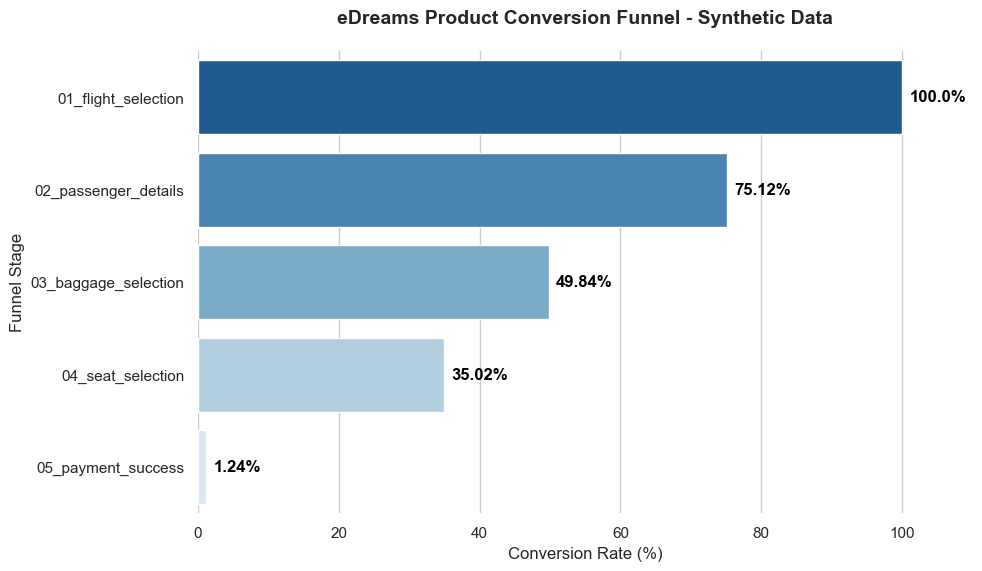
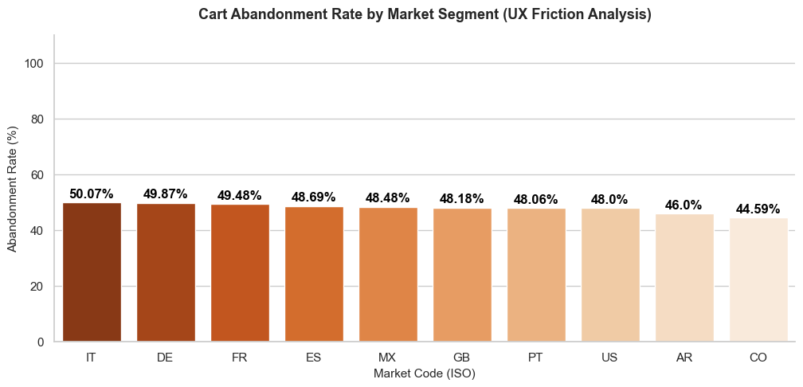

# eDreams Product Case Study: E-Commerce Funnel & UX Analysis ✈️

**Executive Summary**
This case study evaluates the end-to-end user experience (UX) and product design of the eDreams e-commerce booking funnel. The analysis was conducted through a real-time purchasing simulation, navigating from initial flight search up to checkout, translating qualitative friction points into quantitative data models to drive business optimization.

  

## Product Optimization Roadmap

<b>👁️ Stage 1: UX & Accessibility Audit (Completed)</b>

#### 🌐 Module 1.1: Geolocation-Locked Language & Currency Inflexibility
* **The Issue:** The platform forces a strict bundle between the selected storefront country, its official language, and its local currency (e.g., selecting Spain forces Spanish and Euros, with no independent language toggle).
* **UX Impact:** Severe barrier for expatriates and digital nomads, forcing non-native speakers to navigate complex checkout flows and legal terms in a foreign language.

#### 🚨 Module 1.2: Dynamic Font Layout Break (Accessibility Bug)
* **The Issue:** On the baggage selection screen, critical promotional banners suffer severe text truncation and layout collapse under custom system font scalings.
* **UX Impact:** Breaks accessibility for visually impaired users who rely on enlarged operating system fonts, rendering promotional incentives unreadable.

#### 💰 Module 1.3: Inconsistent Price Breakdown Behavior
* **The Issue:** The price breakdown tool completely fails on the specific screen offering refundable tickets, hiding the insurance delta and showing only a consolidated total.
* **UX Impact:** Triggers user defense mechanisms due to a lack of financial transparency at a critical cross-selling touchpoint.

#### 💰 Module 1.4: Static and Linear Seat Pricing
* **The Issue:** The system charges a flat premium fee for any seat within the same cabin zone, ignoring whether it is a window, aisle, or middle seat.
* **UX Impact:** Fails to leverage the higher perceived value of windows/aisles or use discounts to accelerate middle seat allocation.

#### Module 1.5: Weak Address and Postal Code Validation
* **The Issue:** The checkout form accepts mismatched combinations (e.g., City: Barcelona / Postal Code: 53442), completely bypassing regional constraints.
* **UX Impact:** Creates data hygiene issues and elevates operational risks for billing authorization.

#### Module 1.6: Core Conversion Drivers
* **Fluid UI:** Visually pleasing interface with a non-invasive color palette that minimizes cognitive fatigue.
* **Balanced Cross-Selling:** Add-ons do not derail or hijack the user's primary transactional intent.
* **Route Flexibility:** Seamless mixing of independent legs across different airlines.
* **Psychological Triggers:** Effective use of real-time low inventory indicators to drive conversion urgency.

<b>📊 Stage 2: Data-Driven Metric Mapping & Cart Abandonment (Completed) </b>

#### Module 2.1: Metric Formulation & Core Hypothesis
* **Hypothesis:** Pricing opacity coupled with geolocation language-locking acts as the primary driver for high checkout drop-off rates within international cohorts.
* **Formula:**
$$\text{Market Abandonment Rate} = \frac{\text{Total Abandoned Checkout Sessions within Market } X}{\text{Total Checkout Sessions within Market } X} \times 100$$

#### Module 2.2: A/B Testing Experiment Design (Statistical Sizing)
* **Baseline Conversion:** 4.0%
* **Minimum Detectable Effect (MDE):** 15% relative lift (Targeting 4.6% Conversion)
* **Parameters:** $\alpha = 0.05$ (95% Confidence) | Power ($1-\beta$) = 0.80
* **Sample Size Requirement:** 17,923 unique sessions per variant (**35,846 total sessions**).

#### Module 2.3: Data Visualization & Behavioral Insights
* **The Passenger Details Leak (75.12% Retention):** A sharp 24.88% drop occurs right after flight selection, mapping to upfront pricing opacity friction.
* **The Baggage Barrier (49.84% Retention):** A massive 25.28% absolute drop happens at baggage selection, validating the loss of promotional incentives due to the text truncation layout bug.
* **Regional Language Barriers:** Italy (50.07%), Germany (49.87%), and France (49.48%) display the highest cart abandonment rates, validating the friction caused by inflexible language locking.

<b> ⚡ Stage 3: Dynamic Pricing & Ancillary Revenue Optimization (Completed)</b>

#### Module 3.1: Accessibility & Layout Bug Financial Recovery
* **Business Logic:** Simulates fixing the front-end layout bug. Restructuring the checkout dataset fixes baseline distortions where conversion was assumed to be 100%.
* **Financial Model:**
  * *Normal Layout Flow:* Establishes a **~40% conversion rate** baseline.
  * *Bug Variant Flow:* Drop-offs cause checkout conversion to bleed down to **~35%**. Fixes directly protect top-of-funnel ad spend.

#### Module 3.2: Dynamic Pricing & Ancillary Yield Optimization
* **Business Logic:** Deploys a dynamic seat map algorithm based on real-time scarcity. Window/Aisle seats scale linearly in price with occupancy, while Middle seats discount slightly to clear bad inventory.
* **Financial Impact:**
  * Legacy Flat-Rate Revenue: €50,000.00
  * Optimized Dynamic Revenue: €74,878.17
  * **Net Revenue Lift: €+24,878.17** in pure operational margin.

#### Module 3.3: Risk Mitigation & Postal API Integration
* **Business Logic:** Integrates real-time international address verification at checkout to eliminate false-positive payment declines caused by invalid billing data.
* **Financial Impact:**
  * Evaluated Purchase Attempts: 1,000 sessions.
  * Recovered Transactions: 40 checkouts successfully processed.
  * **Revenue Leakage Blocked: €2,600.00** injected straight into the take-rate margin.

<b>Conclusion</b>

This multi-stage roadmap demonstrates the evolution of a structured product mindset: beginning with an empathetic UX and accessibility audit (Stage 1), transitioning into data-driven analytical mapping (Stage 2), and culminating in pure algorithmic revenue optimization (Stage 3).

---

<b>References & Industry Benchmarks</b>

* **Conversion Rates (~4%):** Validated against *Contentsquare's Digital Experience Benchmarks*.
* **Funnel Drop-offs (~75%):** Modeled after *SaleCycle's Airline & Travel Abandonment Reports*.
* **Technical Failures (~3%):** Based on standard web platform SLA error budgets (*Datadog/SRE principles*).

